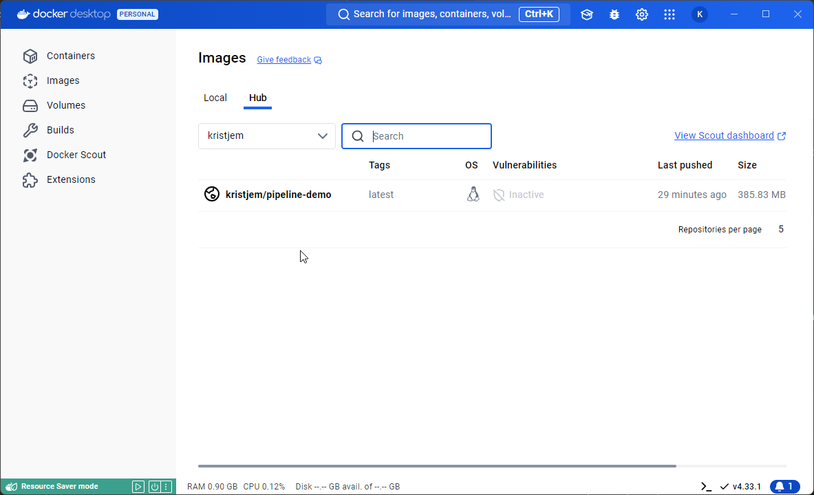

## About the app
This is just a simple app for learning to set up a CI/CD pipeline. 

### Prerequisites
* Github Action Secret variables must be set up in Github, see docker-image.yml in the .github\workflows directory
* Docker Desktop installed, or somewhere else to run the Docker container

### How to trigger the pipeline / Github Actions
1) Go to https://webhook.site/ and get a fresh temporary url to receive webhooks
2) Paste the URL into the "URL" variable in setup.py
3) Commit to main. This will trigger the pipeline, please see docker-image.yml and Dockerfile for details
4) Pull the container in Docker Desktop (select Hub tab)
5) Run the container
4) As the app runs, watch your webhook url in the browser, to see if you received a POST request to it. It will contain a random word and a timestamp.

## Manually:
### Build the Docker image
docker build -t pipeline-demo .

### Run the Docker container with a specific name
docker run -p 5000:5000 --name pipeline-demo-app pipeline-demo

**Docker Desktop after successfully pushing the container to Docker Hub:**
